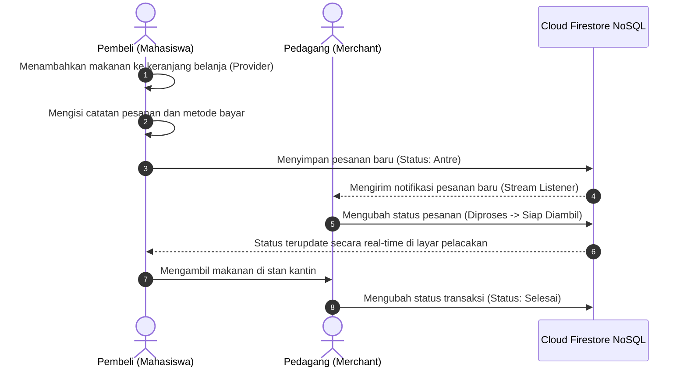

# Blueprint Laporan Akhir Proyek UAS
* **Mata Kuliah:** Pemrograman Mobile
* **Nama Aplikasi:** FoodTrack
* **Skema:** Skema A - 1 Project Besar (PjBL)

Dokumen ini merupakan draf sistematika Laporan Akhir UAS Pemrograman Mobile yang dirancang untuk memenuhi kriteria penilaian akademik. Dokumen ini dapat dipindahkan ke dalam format dokumen resmi (.docx / .pdf) sesuai template yang ditentukan institusi.

---

## Bab I: Pendahuluan

### 1.1 Latar Belakang Masalah
Kantin kampus merupakan fasilitas vital untuk mendukung kebutuhan harian mahasiswa dan staf. Namun, pada jam istirahat kuliah, sering terjadi penumpukan antrean fisik yang panjang pada counter pemesanan makanan. Mahasiswa kehilangan banyak waktu produktif hanya untuk mengantre, sementara pedagang kantin kesulitan mengelola pesanan secara manual di saat jam sibuk. Hal ini berpotensi memicu kesalahan pencatatan pesanan atau ketidakakuratan perhitungan waktu tunggu pelanggan.

### 1.2 Solusi yang Ditawarkan
FoodTrack dirancang sebagai aplikasi mobile berbasis Flutter dan Firebase yang mengusung metode transaksi Self-Pickup (ambil sendiri). Melalui sistem ini, pembeli dapat memesan makanan dari mana saja tanpa harus mengantre secara fisik di depan stan kantin. Pembeli dapat memantau estimasi waktu pengerjaan secara real-time dan mengambil pesanan langsung ketika status pengerjaan telah dinyatakan selesai oleh pedagang.

### 1.3 Pembagian Peran Pengguna (Multi-Role Access)
Aplikasi membagi hak akses pengguna menjadi tiga peran dinamis:
1. **Pembeli:** Berfungsi mencari kantin, memilih menu, menyusun keranjang belanja, melakukan checkout, dan melacak status pesanan secara real-time.
2. **Pedagang:** Panel pengelolaan pesanan untuk memperbarui status pengerjaan makanan secara real-time serta melakukan manajemen menu mandiri.
3. **Admin:** Otoritas pusat untuk melakukan manajemen data kantin global secara terpusat serta memantau statistik aktivitas transaksi.

---

## Bab II: Arsitektur dan Diagram Sistem

### 2.1 Pola Arsitektur Aplikasi
Aplikasi ini mengadopsi pola desain Model-View-ViewModel (MVVM) yang membagi kode program menjadi tiga lapisan utama:
1. **Views (Lapisan Antarmuka):** Diimplementasikan melalui widget Flutter di direktori `lib/pages/` menggunakan pustaka komponen standar.
2. **ViewModels (Lapisan State):** Dikelola oleh `CartProvider` menggunakan paket `provider` untuk menangani status data keranjang belanja secara reaktif.
3. **Models & Services (Lapisan Data):** Berada di direktori `lib/services/` untuk mengurus pertukaran data real-time dengan Cloud Firestore menggunakan snapshots.

### 2.2 Diagram Alur Transaksi (Sequence Diagram)



---

## Bab III: Skema Database Cloud Firestore

Struktur penyimpanan data NoSQL Cloud Firestore dibagi menjadi beberapa koleksi utama sebagai berikut:

### 3.1 Koleksi `users` (Manajemen Pengguna)
```json
{
  "uid": "USER_ID_AUTH",
  "email": "mahasiswa@kampus.ac.id",
  "nama": "Adinda",
  "role": "Pembeli",
  "namaKantin": "",
  "kantinId": "",
  "createdAt": "Timestamp"
}
```

### 3.2 Koleksi `kantin` (Data Kantin Global)
```json
{
  "id": "kantin_4",
  "nama": "Kantin Bakso Mas Jo",
  "deskripsi": "Bakso & Mie Ayam",
  "kategori": "Bakso",
  "gambar": "images/kantin4.jpeg",
  "rating": 4.6,
  "isTop": false,
  "waktu": "10-15 mnt",
  "totalMenu": 5
}
```

### 3.3 Koleksi `menu` (Daftar Item Menu)
```json
{
  "nama": "Bakso Spesial",
  "harga": 16000,
  "stok": 20,
  "desc": "Bakso urat + telur",
  "kantin": "Kantin Bakso Mas Jo",
  "kantinId": "kantin_4",
  "tersedia": true,
  "kategori": "Bakso",
  "gambar": "images/Bakso Spesial.png"
}
```

### 3.4 Koleksi `pesanan` (Log Transaksi Real-time)
```json
{
  "pembeliId": "USER_ID_PEMBELI",
  "pembeliNama": "Adinda",
  "kantin": "Kantin Bakso Mas Jo",
  "kantinId": "kantin_4",
  "totalHarga": 32000,
  "noAntrian": 42,
  "catatan": "Tanpa daun seledri",
  "statusIndex": 0,
  "metodePembayaran": "QRIS",
  "waktu": "Timestamp",
  "items": [
    {
      "nama": "Bakso Spesial",
      "harga": 16000,
      "jumlah": 2
    }
  ]
}
```

---

## Bab IV: Implementasi Fitur Teknis

### 4.1 Modul Cuaca Terintegrasi (Context-Aware Filter)
Aplikasi memanggil data suhu dari API cuaca eksternal (Open-Meteo) berdasarkan titik koordinat daerah kampus. Fitur ini menyaring kategori makanan secara otomatis berdasarkan kondisi suhu udara (misalnya, merekomendasikan menu minuman dingin saat suhu terik, atau soto berkuah hangat saat cuaca dingin).

### 4.2 Perhitungan Waktu Antrean Dinamis (Dynamic Queue Estimator)
Waktu tunggu pada beranda dihitung secara dinamis melalui penapisan jumlah antrean yang berstatus aktif (`statusIndex < 3`) di Firestore:
* `0 pesanan aktif` -> 5-10 menit.
* `1-2 pesanan aktif` -> 10-15 menit.
* `>=3 pesanan aktif` -> 20-25 menit.

### 4.3 Validasi Form Input
Sistem memvalidasi setiap masukan pengguna guna meminimalkan kegagalan data:
* Form login dan pendaftaran divalidasi menggunakan ekspresi reguler (Regex) untuk format email serta minimal panjang karakter sandi.
* Form CRUD kantin/menu memvalidasi tipe data angka pada harga dan memastikan kolom wajib tidak kosong.

---

## Bab V: Pengujian Sistem dan Implementasi QA

### 5.1 Pengujian Terautomasi (Widget Testing)
Pengujian otomatis dideklarasikan pada berkas `test/widget_test.dart` untuk memverifikasi fungsionalitas visual layar onboarding. Pengujian dapat dieksekusi dengan perintah:
```bash
flutter test
```
Hasil pengujian menunjukkan status berhasil penuh tanpa adanya kegagalan program.

### 5.2 Pengujian Manual (Manual QA)
Skenario pengujian manual mencakup integrasi pengiriman pesanan pembeli yang langsung terbaca pada dashboard pedagang dalam hitungan detik, serta kelancaran database seeder untuk menginisialisasi data kantin default ketika koleksi database terdeteksi kosong.

---

## Bab VI: Kesimpulan

Aplikasi FoodTrack telah diimplementasikan sepenuhnya sesuai dengan ketentuan Skema A Pemrograman Mobile. Pemisahan komponen UI dengan business logic menggunakan State Management Provider serta pemanfaatan database real-time Cloud Firestore menghasilkan aplikasi mobile yang stabil, responsif, dan siap untuk digunakan dalam lingkungan kantin kampus.
