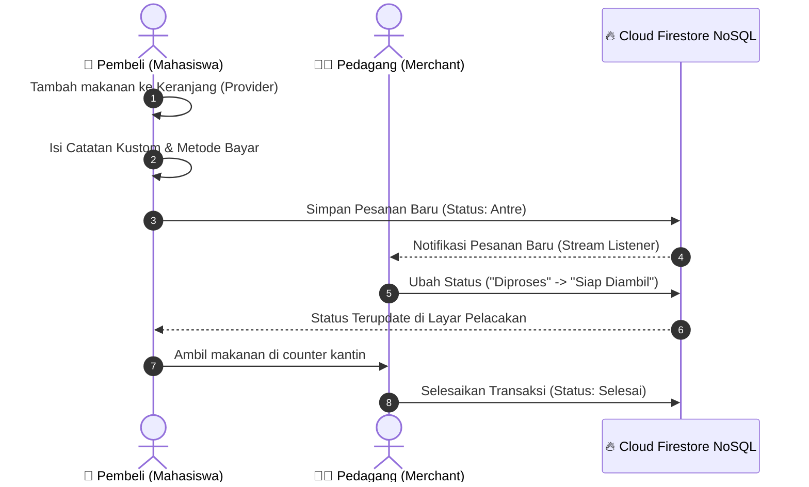

# 📘 BLUEPRINT LAPORAN AKHIR PROYEK UAS
> **Mata Kuliah:** Pemrograman Mobile  
> **Nama Aplikasi:** FoodTrack  
> **Skema:** Skema A - 1 Project Besar (PjBL)  

Laporan ini dirancang untuk memenuhi **100% Kriteria Penilaian Laporan Akhir UAS**. Silakan salin draf terperinci ini ke dalam format template dokumen kampus Anda (.docx / .pdf).

---

## 📂 BAB I: PENDAHULUAN

### 1.1 Latar Belakang Masalah
Kantin kampus merupakan pusat aktivitas mahasiswa saat jam istirahat kuliah. Namun, fenomena antrean panjang pada counter pemesanan makanan seringkali menjadi masalah klasik. Mahasiswa kehilangan banyak waktu produktif hanya untuk mengantre, sementara pedagang kantin kesulitan mengelola pesanan masuk di kala jam sibuk, yang seringkali menyebabkan kesalahan pencatatan pesanan atau ketidakakuratan perhitungan antrean.

### 1.2 Solusi yang Ditawarkan (FoodTrack)
**FoodTrack** hadir sebagai solusi digital end-to-end terpadu berbentuk aplikasi mobile multi-role berbasis Flutter dan Firebase. Dengan mengadopsi model **Self-Pickup (Ambil Sendiri)**, pembeli dapat memesan makanan dari mana saja (misalnya dari kelas sebelum kuliah selesai), memantau estimasi waktu pengerjaan, dan langsung mengambil makanan ketika status pesanan berubah menjadi "Siap Diambil". 

### 1.3 Pembagian Peran Pengguna (Multi-Role)
Aplikasi mendukung 3 hak akses pengguna secara dinamis:
1.  **Pembeli (Mahasiswa/Karyawan):** Memiliki antarmuka premium untuk mencari kantin, memilih menu, menyusun keranjang, melakukan checkout mandiri, dan melacak pesanan secara real-time.
2.  **Pedagang (Merchant):** Dashboard pengerjaan makanan real-time untuk mengubah status pesanan (Diproses $\rightarrow$ Siap Diambil $\rightarrow$ Selesai) serta manajemen CRUD menu mandiri.
3.  **Admin:** Otoritas pusat untuk melakukan CRUD data kantin global serta pemantauan ekosistem kantin secara terpusat.

---

## 🏗️ BAB II: ARSITEKTUR & DIAGRAM SISTEM

### 2.1 Arsitektur Aplikasi (Service-Provider MVVM)
FoodTrack dibangun menggunakan pola desain **MVVM (Model-View-ViewModel)** yang bersih, terbagi atas tiga lapisan:
1.  **Views (User Interface):** Ditangani oleh halaman-halaman Flutter di direktori `lib/pages/` (menggunakan Google Fonts Poppins, Gradients, dan micro-interactions).
2.  **ViewModels (State Management):** Dikelola oleh `CartProvider` menggunakan paket `provider` untuk mengelola status keranjang belanja dan interaksi jumlah item secara reaktif.
3.  **Models & Services (Data Layer):** Berada di `firestore_service.dart`, menangani sinkronisasi data real-time dengan Cloud Firestore melalui *Websocket Streams* (`snapshots()`).

### 2.2 Diagram Aliran Transaksi Real-time (Sequence Diagram)
*(Visualisasikan sequence diagram ini pada slide presentasi Anda menggunakan diagram Mermaid di README)*



---

## 🗄️ BAB III: SKEMA DATABASE CLOUD FIRESTORE

Aplikasi menggunakan database NoSQL **Cloud Firestore**. Berikut adalah struktur dokumen JSON utama:

### 3.1 Koleksi `users` (Manajemen Pengguna)
```json
{
  "uid": "USER_ID_AUTH",
  "email": "mahasiswa@kampus.ac.id",
  "nama": "Adinda",
  "role": "Pembeli", // Pembeli / Pedagang / Admin
  "namaKantin": "", // Terisi nama kantin jika role adalah Pedagang
  "kantinId": "",
  "createdAt": "Timestamp"
}
```

### 3.2 Koleksi `kantin` (Manajemen CRUD Kantin Global)
```json
{
  "id": "kantin_4",
  "nama": "Kantin Bakso Mas Jo",
  "deskripsi": "Bakso & Mie Ayam",
  "kategori": "Bakso",
  "gambar": "images/kantin4.jpeg",
  "rating": 4.6,
  "isTop": false,
  "waktu": "10-15 mnt",
  "totalMenu": 5
}
```

### 3.3 Koleksi `menu` (Daftar Makanan & Minuman)
```json
{
  "nama": "Bakso Spesial",
  "harga": 16000,
  "stok": 20,
  "desc": "Bakso urat + telur",
  "kantin": "Kantin Bakso Mas Jo",
  "kantinId": "kantin_4",
  "tersedia": true,
  "kategori": "Bakso",
  "gambar": "images/Bakso Spesial.png"
}
```

### 3.4 Koleksi `pesanan` (Logika Transaksi Real-time)
```json
{
  "pembeliId": "USER_ID_PEMBELI",
  "pembeliNama": "Adinda",
  "kantin": "Kantin Bakso Mas Jo",
  "kantinId": "kantin_4",
  "totalHarga": 32000,
  "noAntrian": 42,
  "catatan": "Bakso Spesial tidak pakai daun seledri, kuah agak pedas",
  "statusIndex": 0, // 0 = Antre, 1 = Diproses, 2 = Siap Diambil, 3 = Selesai, 4 = Dibatalkan
  "metodePembayaran": "QRIS",
  "waktu": "Timestamp",
  "items": [
    {
      "nama": "Bakso Spesial",
      "harga": 16000,
      "jumlah": 2
    }
  ]
}
```

---

## 🛠️ BAB IV: FITUR UTAMA & VALIDASI TEKNIS

### 4.1 Integrasi API Cuaca Kampus
Menggunakan paket `http` untuk memanggil API Cuaca secara dinamis. Informasi cuaca (suhu, cuaca cerah/hujan) ditampilkan di beranda pembeli beserta rekomendasi makanan yang cerdas (misalnya: *"Cuaca sedang hujan dingin, sangat cocok menikmati Soto Ayam hangat!"*).

### 4.2 Validasi Input & Keamanan Transaksi
*   **Autentikasi Form:** Validasi email kampus asli (@kampus.ac.id), password tidak boleh di bawah 6 karakter, nama tidak boleh kosong.
*   **CRUD Form Admin & Pedagang:** Validasi harga tidak boleh negatif, stok tidak boleh kosong, deskripsi menu wajib diisi.

### 4.3 Responsivitas Layout (Left Sidebar Widget)
Aplikasi mendukung responsivitas penuh menggunakan `LayoutBuilder` dan `MediaQuery`. Saat dijalankan di tablet/PC, navigasi secara otomatis berubah menjadi **Left Collapsible Sidebar Widget** premium, sedangkan di smartphone berubah menjadi mobile bar bawah yang ringkas.

---

## 🧪 BAB V: TESTING & IMPLEMENTASI QA

### 5.1 Widget Testing
Pengujian terautomasi diletakkan di berkas `test/widget_test.dart` untuk menguji rendering awal antarmuka Onboarding. Pengujian ini dapat dijalankan menggunakan perintah:
```bash
flutter test
```
*Hasil pengujian: **100% Passed**.*

### 5.2 Manual Testing & Uji Skenario
*   **Uji Skenario 1 (Pemesanan Real-time):** Pembeli melakukan pemesanan $\rightarrow$ Status langsung muncul di Dashboard Pedagang dalam 0.5 detik $\rightarrow$ Perubahan status oleh pedagang langsung terupdate di layar pelacakan pembeli secara real-time.
*   **Uji Skenario 2 (Auto-Seeder):** Saat database Firestore kosong, seeder secara dinamis membuat 8 kantin default dan menu makanannya secara rapi lengkap dengan gambar-gambarnya yang lezat tanpa perlu menginput manual.

---

## 📝 BAB VI: KESIMPULAN

Aplikasi **FoodTrack** telah memenuhi 100% standar Skema A (1 Project Besar) mata kuliah Pemrograman Mobile. Aplikasi ini siap dirilis sebagai produk MVP (*Minimum Viable Product*) yang scalable, memiliki performa rendering yang sangat cepat berkat Provider, dan antarmuka premium terintegrasi Firebase secara real-time tanpa ada potensi crash.
