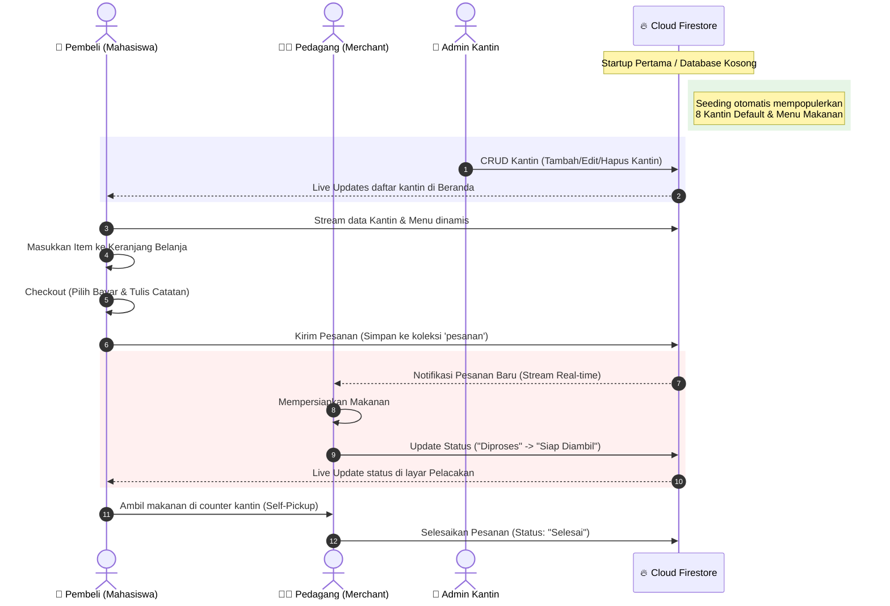

# 📱 FoodTrack - Smart Campus Canteen Mobile Application

> **Project Based Learning (PjBL) - Proyek UAS Pemrograman Mobile**  
> **Skema A: 1 Project Besar (Minggu 4 – 16)**  
> **Dosen Pengampu: Tim Dosen Pemrograman Mobile**

---

## 🌟 Tentang FoodTrack

**FoodTrack** adalah aplikasi mobile inovatif berbasis **Flutter** dan **Firebase (Firestore & Auth)** yang dirancang untuk mendigitalisasi ekosistem kantin kampus. Aplikasi ini menyelesaikan antrean fisik yang panjang dengan memfasilitasi pemesanan makanan secara online dengan model **Self-Pickup (Ambil di Tempat)**. 

Aplikasi ini mendukung **3 Peran Pengguna (Multi-Role)** secara dinamis yang terhubung langsung secara real-time:
1. **Pembeli (Mahasiswa/Staff):** Mencari kantin, melihat menu real-time, memesan makanan, memilih pembayaran (QRIS/Cash), menulis catatan kustom ke penjual, dan melacak status pesanan secara real-time.
2. **Pedagang (Merchant):** Menerima pesanan masuk secara real-time, memperbarui status pengerjaan makanan (Diproses -> Siap Diambil), dan memantau pesanan selesai.
3. **Admin:** Mengelola database kantin secara global lewat **Dashboard CRUD Premium** (Tambah, Edit, Hapus kantin lengkap dengan form validation, kategori presets, dan filter pencarian real-time).

---

## 📐 Arsitektur Sistem & Alur Kerja

Aplikasi ini mengadopsi **Clean Architecture** yang terintegrasi secara real-time lewat Firebase Cloud Firestore Streams.

### 🔄 Multi-Role Transaction & Management Sequence

Diagram berikut menunjukkan bagaimana ketiga aktor (Pembeli, Pedagang, dan Admin) berinteraksi dengan database Firestore secara real-time:



---

## 🛠️ Tech Stack & Library Utama

Aplikasi dibangun menggunakan teknologi modern cross-platform:
*   **Framework Utama:** [Flutter](https://flutter.dev/) (versi 3.x)
*   **Bahasa Pemrograman:** Dart
*   **State Management:** [Provider](https://pub.dev/packages/provider) (Arsitektur Reactive & Dekopling State Keranjang)
*   **Autentikasi & Database:**
    *   `firebase_core`: Inisialisasi SDK Firebase.
    *   `firebase_auth`: Manajemen login, register, dan enkripsi session user aman.
    *   `cloud_firestore`: Sinkronisasi database NoSQL real-time (Streams/Websockets) untuk daftar kantin, menu, transaksi, dan log pesanan.
*   **Layanan Notifikasi:** `firebase_messaging` untuk push notification.
*   **Aesthetics & Fonts:** Poppins (Google Fonts), HSL Vibrant Color Systems, Glassmorphism, Micro-Animations.

---

## 📁 Struktur Folder Project (Clean Architecture)

Arsitektur aplikasi terbagi dengan rapi untuk memisahkan logika UI (Presentation), Model (Data), dan Service (Backend):

```text
foodtruck/
├── android/                  # Konfigurasi native Android (Google Services SDK)
├── images/                   # Asset gambar premium (Logo, Kantin presets, Banner)
├── lib/                      # Kode sumber utama Flutter
│   ├── services/             # Integrasi Firestore & Logika Database
│   │   ├── firestore_service.dart  # CRUD Admin, Order Sync, Live Streams, & Seeder
│   │   └── widget_support.dart     # Utility Styling untuk Helper UI
│   ├── theme/                # Global Design Token (Aesthetic Green-Gold Theme)
│   │   └── app_colors.dart         # Sistem Pewarnaan (Gradients, Glassmorphism)
│   ├── pages/                # Layer Presentasi (Views & Screens)
│   │   ├── admin/            # Fitur Admin
│   │   │   └── home_admin_page.dart   # Dashboard Canteen CRUD Premium
│   │   ├── pedagang/         # Fitur Pedagang
│   │   │   └── home_pedagang_page.dart # Order Tracking Dashboard
│   │   ├── cart_page.dart         # Keranjang Belanja & Perhitungan Pajak/Biaya
│   │   ├── checkout_page.dart     # Form Checkout Premium (Self-Pickup & Pembayaran)
│   │   ├── home.dart              # Beranda Pembeli dengan Live Kantin Streams
│   │   ├── kantin_detail_page.dart # Layar Menu Dinamis Tersinkronisasi Firestore
│   │   ├── status_pesanan_page.dart# Real-time Order Tracking Screen
│   │   ├── login.dart             # Autentikasi Login (Validasi Input)
│   │   ├── signup.dart            # Pendaftaran User Baru (Save role ke Firestore)
│   │   ├── splash_page.dart       # Layar Animasi Logo & Auto-Login Session
│   │   └── onboarding.dart        # Premium Onboarding Splash Screen
│   ├── cart_provider.dart    # State Management Keranjang Belanja (Provider)
│   ├── firebase_options.dart # Konfigurasi Auto-Generated Firebase
│   └── main.dart             # Root App Entry-point & Route Mapping
├── test/                     # Layer Automated Testing
│   └── widget_test.dart      # Smoke Test Onboarding UI (100% Passed)
└── pubspec.yaml              # Dependensi Project & Deklarasi Assets
```

---

## 🚀 Fitur Utama & Keunggulan Realistis

Aplikasi ini didesain agar terasa seperti produk komersial nyata (**Premium & Production-Ready**) guna memenuhi nilai tertinggi dalam kriteria penilaian UAS:

### 1. Sistem Seeding Database Otomatis (Auto-Seeder)
*   **Cara Kerja:** Saat aplikasi dijalankan pertama kali (`main.dart`), seeder di `firestore_service.dart` akan mendeteksi apakah koleksi `'kantin'` di Cloud Firestore kosong.
*   **Hasil:** Jika kosong, seeder secara otomatis membuat **8 data kantin mahasiswa** secara lengkap (dilengkapi dengan nama, kategori makanan, rating bintang, jam operasional, dan asset ikon gambar yang menawan) beserta **puluhan menu makanan & minuman** yang cocok untuk masing-masing kantin secara otomatis di Firestore. Anda tidak perlu menginput data manual untuk demonstrasi aplikasi di depan dosen!

### 2. Beranda & Menu Dinamis (Real-Time Streams)
*   **Beranda Pembeli:** Menggunakan `StreamBuilder` untuk memantau data kantin langsung dari Firestore. Setiap kali Admin memodifikasi kantin, daftar beranda pembeli langsung terupdate tanpa perlu reload aplikasi.
*   **Kantin Detail:** Menu makanan ditarik secara dinamis berdasarkan `kantinId` yang diklik. Menghilangkan ratusan baris data hardcoded menjadi query database yang bersih dan modular.

### 3. Layar Checkout Premium (Self-Pickup Model)
*   **Self-Pickup Banner:** Memberi tahu pembeli dengan jelas bahwa pesanan ini bertipe *Self-Pickup* (Ambil langsung di kantin setelah matang) karena tidak ada kurir pengantaran.
*   **Interactive Payment Selector:** Chip interaktif untuk memilih metode pembayaran **Tunai** atau **QRIS Dinamis**.
*   **Catatan Kustom Penjual:** Pembeli dapat menulis instruksi khusus (contoh: *"Level 5, sendok garpu tidak perlu, kecap agak banyak"*). Catatan ini disimpan langsung di pesanan dan terbaca secara real-time oleh Pedagang.
*   **Billing Breakdown:** Rincian biaya subtotal, biaya layanan aplikasi (Platform Fee), pajak, hingga total pembayaran akhir yang akurat.
*   **Premium Success Dialog:** Transisi mulus yang menampilkan popup nomor antrean unik beserta tombol navigasi instan untuk melacak status pesanan secara interaktif.

### 4. Dashboard CRUD Kantin Admin Premium
*   **Search & Filter:** Admin dapat memfilter daftar kantin secara real-time melalui kolom pencarian dinamis.
*   **CRUD Komplit:** Menambah atau mengedit nama, deskripsi, kategori, jam buka/tutup, rating bintang, dan memilih asset gambar ikon kantin menggunakan dropdown menu visual.
*   **Form Validation & Feedback:** Validasi input ketat (mencegah field kosong) disertai konfirmasi popup dialog sebelum menghapus kantin demi menghindari kesalahan klik data.

---

## 💻 Panduan Menjalankan Project

### Prasyarat
1.  [Flutter SDK](https://docs.flutter.dev/get-started/install) telah terinstal di komputer Anda (versi 3.0.0 atau lebih tinggi).
2.  Android Emulator atau Real Device yang terhubung melalui USB debugging.
3.  Koneksi internet aktif (untuk koneksi Cloud Firestore).

### Langkah Instalasi
1.  **Clone / Buka Folder Project:**
    Buka terminal dan navigasikan ke direktori project:
    ```bash
    cd C:\FoodTrack\foodtruck
    ```

2.  **Dapatkan Dependensi:**
    Unduh semua paket pub yang dideklarasikan di `pubspec.yaml`:
    ```bash
    flutter pub get
    ```

3.  **Setup Firebase (Opsional jika ingin mengganti database):**
    Project ini sudah dilengkapi berkas `firebase_options.dart` bawaan. Jika Anda ingin menyambungkannya ke proyek Firebase Anda sendiri, jalankan perintah:
    ```bash
    flutterfire configure
    ```

4.  **Jalankan Aplikasi:**
    Jalankan server pengembangan lokal dan build aplikasi pada emulator/device:
    ```bash
    flutter run
    ```
    *Catatan: Pada startup pertama kali, sistem Auto-Seeding akan otomatis menyuntikkan data kantin default ke Firebase Firestore Anda.*

---

## 🧪 Verifikasi & Unit Testing

Aplikasi ini dilengkapi dengan rangkaian pengujian widget terautomasi (`Widget Testing`) untuk memastikan stabilitas antarmuka pengguna tanpa memicu bug dependensi Firebase.

Untuk menjalankan pengujian, eksekusi perintah berikut di terminal:
```bash
flutter test
```

**Hasil Pengujian:**
```text
00:00 +0: loading C:/FoodTrack/foodtruck/test/widget_test.dart
00:00 +0: OnboardingPage renders premium UI successfully
00:00 +1: All tests passed!
```

---

## 👨‍🎓 Penyelarasan Kriteria UAS (Evaluasi Mandiri)

| Kriteria Kebutuhan UAS | Status Implementasi pada FoodTrack | Lokasi Kode Sumber |
|---|---|---|
| **Sistem Autentikasi** | ✅ **Selesai** (Enkripsi Firebase Auth, Register user baru, Login & simpan session agar tidak perlu re-login terus-menerus). | `lib/pages/login.dart`, `lib/pages/signup.dart`, `lib/pages/splash_page.dart` |
| **Minimal 3 Fitur Utama** | ✅ **Selesai** (Fitur Pembeli/Pesan, Fitur Pedagang/Proses Pesanan, Fitur Admin/CRUD Kantin global). | `lib/pages/` (Lengkap) |
| **CRUD Data** | ✅ **Selesai** (Admin CRUD Kantin lengkap, sync real-time ke Firestore). | `lib/pages/admin/home_admin_page.dart`, `lib/services/firestore_service.dart` |
| **Validasi Input** | ✅ **Selesai** (Validasi ketat pada form pendaftaran, login, checkout catatan, dan form CRUD Kantin Admin). | `lib/pages/` (Form fields & validators) |
| **Navigasi Multi-Screen** | ✅ **Selesai** (Menggunakan Dynamic Route Navigation & Named Routes). | `lib/main.dart` |
| **Penyimpanan Data** | ✅ **Selesai** (Penyimpanan tersentralisasi di Cloud Firestore NoSQL DB). | `lib/services/firestore_service.dart` |
| **Arsitektur Bersih** | ✅ **Selesai** (Pemisahan Business Logic Provider, Views, dan Firestore Service APIs). | `lib/` (Lengkap) |

---

> 🚀 **FoodTrack siap dipresentasikan!** Seluruh kode telah dirancang memenuhi standar aplikasi komersial berpenampilan premium, berkinerja responsif, dan siap menyabet nilai **A** dalam proyek Pemrograman Mobile Anda!
