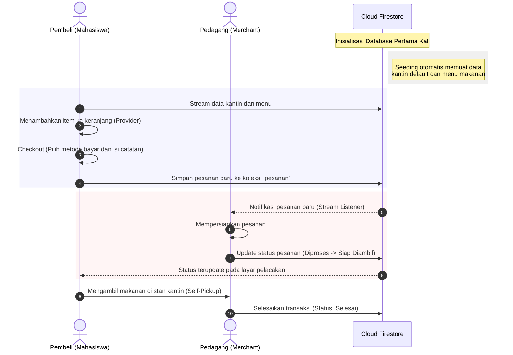

# FoodTrack - Sistem Pemesanan dan Manajemen Kantin Kampus

Proyek ini merupakan implementasi aplikasi mobile berbasis Flutter dan Firebase yang dirancang untuk mendigitalisasi transaksi di lingkungan kantin kampus. Aplikasi ini mengusung metode pemesanan *Self-Pickup* guna meminimalkan antrean fisik pada stan kantin.

---

## Deskripsi Sistem

FoodTrack membagi peran pengguna menjadi tiga kategori yang terintegrasi secara real-time melalui Firebase Cloud Firestore:

1. **Pembeli (Mahasiswa/Staf):** Berfungsi untuk mencari kantin, memesan makanan/minuman, menentukan catatan pesanan, memilih metode pembayaran (Cash atau QRIS), serta melacak status pembuatan makanan secara real-time.
2. **Pedagang (Merchant/Kantin):** Berfungsi sebagai panel kontrol dapur untuk menerima pesanan masuk secara real-time, mengubah status pesanan (Diproses, Siap Diambil, Selesai), dan mengelola menu kantin mereka secara mandiri.
3. **Administrator (Admin):** Berfungsi untuk mengelola data kantin global (tambah, edit, dan hapus data kantin) serta memantau statistik aktivitas transaksi seluruh ekosistem kantin.

---

## Arsitektur Sistem dan Alur Kerja

Aplikasi ini menggunakan pola arsitektur yang terbagi atas presentation layer, state management, dan data service layer. Sinkronisasi data real-time ditangani melalui streams database Firestore.

### Diagram Alur Transaksi (Sequence Diagram)

Berikut merupakan diagram alur transaksi interaksi antara Pembeli, Pedagang, dan Cloud Firestore:



---

## Teknologi dan Pustaka Utama

* **Framework Utama:** Flutter (Dart SDK)
* **State Management:** Provider (Manajemen state reaktif untuk keranjang belanja)
* **Backend dan Autentikasi:**
  * `firebase_core`: Inisialisasi SDK Firebase.
  * `firebase_auth`: Manajemen pendaftaran dan masuk pengguna.
  * `cloud_firestore`: Sinkronisasi database NoSQL real-time melalui websocket streams.
* **Layanan Pendukung:** `http` (Integrasi API cuaca eksternal).

---

## Struktur Direktori Proyek

Struktur folder di bawah direktori `lib/` disusun berdasarkan pemisahan tanggung jawab kode program:

```text
foodtruck/
├── android/                  # Konfigurasi platform Android native
├── assets/                   # Aset statis aplikasi
├── images/                   # Berkas gambar ikon dan menu kantin
├── lib/                      # Kode sumber utama Flutter
│   ├── services/             # Integrasi database dan API eksternal
│   │   ├── firestore_service.dart  # Query Firestore, Auth Helper, dan Database Seeder
│   │   └── queue_service.dart      # Penghitung antrean dinamis kantin
│   ├── theme/                # Global Design Token
│   │   └── app_colors.dart         # Sistem pewarnaan dan gradien antarmuka
│   ├── pages/                # Lapisan antarmuka pengguna (Views)
│   │   ├── admin/            # Halaman statistik dan manajemen kantin global
│   │   │   └── home_admin_page.dart
│   │   ├── pedagang/         # Panel pengelolaan pesanan dan promo merchant
│   │   │   ├── home_pedagang_page.dart
│   │   │   ├── menu_pedagang_page.dart
│   │   │   ├── pedagang_promo_page.dart
│   │   │   └── profil_pedagang_page.dart
│   │   ├── user/             # Panel fitur pembeli
│   │   │   ├── order_history_page.dart
│   │   │   └── redeem_points_page.dart
│   │   ├── cart_page.dart         # Halaman kalkulasi dan pengelolaan keranjang belanja
│   │   ├── checkout_page.dart     # Halaman pembayaran dan pengiriman instruksi
│   │   ├── home.dart              # Halaman beranda utama pembeli
│   │   ├── kantin_detail_page.dart # Halaman daftar menu detail kantin
│   │   ├── status_pesanan_page.dart# Halaman pelacakan status pesanan real-time
│   │   ├── login.dart             # Halaman masuk pengguna
│   │   ├── signup.dart            # Halaman daftar akun baru
│   │   └── onboarding.dart        # Halaman onboarding pengguna baru
│   ├── cart_provider.dart    # Kelas Provider untuk pengelolaan state keranjang
│   ├── firebase_options.dart # Berkas konfigurasi penghubung Firebase
│   └── main.dart             # Berkas masuk utama aplikasi (Entry Point)
├── test/                     # Berkas pengujian unit/widget terautomasi
└── pubspec.yaml              # Dependensi pustaka proyek Flutter
```

---

## Fitur Teknis Utama

### 1. Inisialisasi Otomatis Database (Database Seeder)
Aplikasi menyertakan mekanisme seeding otomatis di `firestore_service.dart`. Apabila koleksi `'kantin'` di database Firestore terdeteksi kosong saat pertama kali dijalankan, sistem akan mengisi data 8 kantin default beserta daftar menunya secara otomatis. Hal ini memudahkan pengujian sistem tanpa memerlukan entri data manual dari awal.

### 2. Estimasi Waktu Tunggu Dinamis (Dynamic Queue Estimator)
Waktu tunggu pemesanan dihitung secara dinamis di `queue_service.dart` dengan melacak jumlah pesanan aktif yang sedang diproses di dapur (`statusIndex < 3`):
* `0 pesanan aktif` -> Waktu tunggu: 5-10 menit.
* `1-2 pesanan aktif` -> Waktu tunggu: 10-15 menit.
* `>=3 pesanan aktif` -> Waktu tunggu: 20-25 menit.

### 3. Filter Kontekstual Berbasis Cuaca (Weather API Integration)
Aplikasi menggunakan data dari API cuaca eksternal untuk mendeteksi suhu di koordinat daerah kampus. Pengguna dapat menyaring kategori menu makanan secara otomatis yang disesuaikan dengan kondisi cuaca (contoh: menyarankan makanan hangat seperti soto ketika cuaca dingin/hujan).

### 4. Pelacakan Transaksi Real-Time
Status pesanan dihubungkan langsung dari panel pedagang ke layar pembeli menggunakan Firestore Streams. Setiap perubahan status pengerjaan yang dilakukan pedagang akan langsung tecermin di layar pembeli dalam hitungan milidetik secara reaktif.

---

## Panduan Instalasi dan Menjalankan Proyek

### Prasyarat
1. Flutter SDK versi stabil terbaru telah terpasang di komputer Anda.
2. Emulator Android atau perangkat fisik Android yang terhubung melalui USB Debugging.
3. Koneksi internet aktif untuk sinkronisasi database Firestore.

### Langkah Instalasi
1. Buka direktori proyek melalui terminal:
   ```bash
   cd C:\FoodTrack\foodtruck
   ```
2. Unduh semua paket dependensi yang terdaftar di `pubspec.yaml`:
   ```bash
   flutter pub get
   ```
3. Hubungkan proyek dengan Firebase Anda (opsional jika ingin mengganti instance database):
   ```bash
   flutterfire configure
   ```
4. Jalankan aplikasi pada perangkat yang terhubung:
   ```bash
   flutter run
   ```

---

## Pengujian Terautomasi (Widget Testing)

Pengujian fungsionalitas UI onboarding dideklarasikan pada berkas `test/widget_test.dart`. Jalankan pengujian melalui perintah berikut:
```bash
flutter test
```

Hasil pengujian yang berhasil:
```text
00:00 +0: loading C:/FoodTrack/foodtruck/test/widget_test.dart
00:00 +0: OnboardingPage renders premium UI successfully
00:00 +1: All tests passed!
```

---

## Kesesuaian Kriteria Penilaian Evaluasi Akhir

| Kriteria Persyaratan | Implementasi Sistem | Berkas Terkait |
|---|---|---|
| **Sistem Autentikasi** | Tersedia login, registrasi akun baru, dan auto-login session berbasis Firebase Auth. | `lib/pages/login.dart`, `lib/pages/signup.dart` |
| **Multi-Role User** | Pembeli (Mahasiswa), Pedagang (Kantin), dan Administrator. | `lib/pages/` (Direktori admin & pedagang) |
| **Penyimpanan Data** | Menggunakan Cloud Firestore NoSQL Database untuk sinkronisasi data global. | `lib/services/firestore_service.dart` |
| **Fungsi CRUD** | Pengelolaan data kantin global oleh Admin dan pengelolaan menu makanan oleh Pedagang. | `lib/pages/admin/home_admin_page.dart`, `lib/pages/pedagang/menu_pedagang_page.dart` |
| **Validasi Input** | Pemeriksaan kesesuaian input form pada pendaftaran, login, dan form entri data CRUD. | `lib/pages/` (Form validation & error messaging) |
| **Navigasi Layar** | Navigasi dinamis antar halaman menggunakan Route Name. | `lib/main.dart` |
| **State Management** | Pengelolaan keranjang belanja terpusat secara reaktif. | `lib/cart_provider.dart` |
